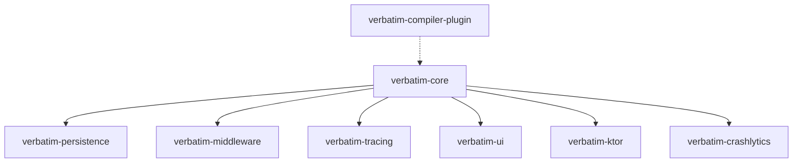

# Overview

**Verbatim** is a comprehensive, asynchronous telemetry engine for Kotlin Multiplatform (KMP) logging infrastructure. Unlike standard logging wrappers that merely redirect print statements to `Logcat` or `NSLog`, Verbatim delivers automated privacy masking, micro-metric tracing, and crash-resilient local storage.

## Why Verbatim?

Managing logging in a KMP project often involves basic console output with no structured data, no privacy controls, and no production-grade telemetry. Verbatim solves this by providing a complete logging pipeline with:

- **Zero-allocation lazy evaluation** - String concatenation never executes if the log level is filtered out
- **Structured logging** - Attach typed key-value attributes to any log event
- **Context propagation** - Thread-safe coroutine context that survives thread hops
- **Modular architecture** - Only compile and ship the exact code your architecture requires
- **Privacy-first design** - Built-in PII scrubbing and annotation-driven masking
- **Production-ready persistence** - Okio-backed file streaming with rotation and encryption

## Architecture

Verbatim is distributed as a set of highly decoupled, flat modules under the `dev.teogor.verbatim` group ID:



| Module | Purpose |
|--------|---------|
| `verbatim-core` | Core pipeline, console sinks, context propagation |
| `verbatim-persistence` | Okio-backed file streaming, rotation, encryption |
| `verbatim-middleware` | PII scrubbing, regex compliance, annotations |
| `verbatim-tracing` | Micro-metrics, execution timers, OpenTelemetry spans |
| `verbatim-ui` | Compose Multiplatform on-device diagnostic console |
| `verbatim-compiler-plugin` | Bytecode IR transformer for log stripping |
| `verbatim-ktor` | Ktor HTTP client call tracking |
| `verbatim-crashlytics` | Abstract crash reporting sink (user-provided engine) |

## Quick Start

```kotlin
// 1. Add dependency
commonMain.dependencies {
    implementation("dev.teogor.verbatim:verbatim-core:1.0.0-alpha01")
}

// 2. Initialize
Verbatim.initialize {
    minimumLogLevel = LogLevel.DEBUG
}

// 3. Log
val logger = Verbatim.logger(tag = "MyApp")
logger.info { "Application started" }
```

## Platform Support

Verbatim supports all major Kotlin Multiplatform targets:

| Platform | Output |
|----------|--------|
| Android | `android.util.Log` (Logcat) |
| iOS / macOS | `NSLog` |
| JVM / Desktop | `stdout` |
| JS / Wasm | `console` |

## Community

Verbatim is open-source and maintained by [teogor](https://github.com/teogor). Contributions are welcome!
